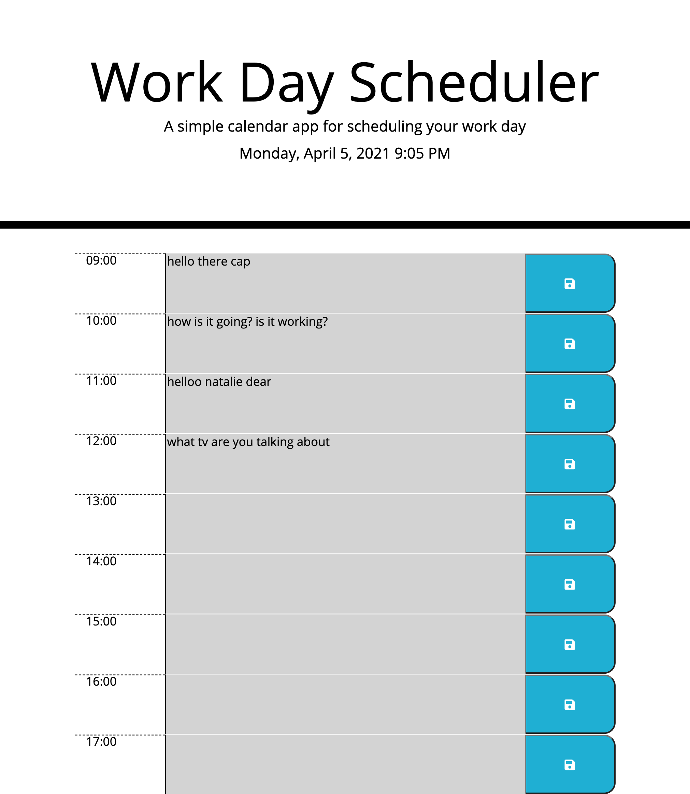

# Work Day Scheduler

The work day scheduler is an application that allows the user to create events based on their work day. Each one hour time segment's background color reflects whether the event happend(gray), is ongoing(red), or is in the furute(green).

The Work day scheduler is fully functional based on the User Story but it is not dynamic in the users perspective. Addition functionality could be added in future iterations so the user can choose the time period for the scheduler(not always 9-5),the user can choose the duration of each event(not always 1-hour segments) or even change the event dynamically as needed.

Interesting JavaScript concepts used:

    - Moment.js
    - LocalStorage
    - JSON.strigify/JSON.parse
    - JQuery
    - Bootstrap
    - EventListeners
    - setInterval

---

## User Story

```
* AS AN employee with a busy schedule
* I WANT to add important events to a daily planner
* SO THAT I can manage my time effectively
```

---

## Acceptance Criteria

```
* GIVEN I am using a daily planner to create a schedule
* WHEN I open the planner
* THEN the current day is displayed at the top of the calendar
* WHEN I scroll down
* THEN I am presented with time blocks for standard business hours
* WHEN I view the time blocks for that day
* THEN each time block is color-coded to indicate whether it is in the past, present, or future
* WHEN I click into a time block
* THEN I can enter an event
* WHEN I click the save button for that time block
* THEN the text for that event is saved in local storage
* WHEN I refresh the page
* THEN the saved events persist
```

---

## ScreenShots




---

## Link to Deployed Application

https://allanp94.github.io/05-work-day-scheduler/
